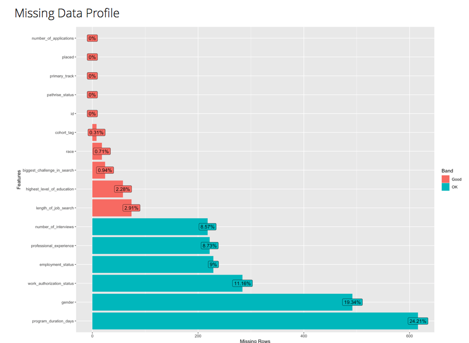

<style>
@import url('https://fonts.googleapis.com/css?family=Nanum+Gothic|Quicksand');
</style>
```{r setup, include=FALSE, message=FALSE, warning=FALSE}
library(readr)
library(tidyverse)
library(flexdashboard) 
library(highcharter)
library(DT)
library(printr)
library(lubridate)
library(timeDate)
raw_data <- read_csv("DATA/pathrise_data.csv")
```
```{r}
hist.fun<- function(data,hist_title){
 
  hchart(data,  showInLegend=FALSE)%>% 
    #hc_xAxis(title=list(text="Wordcount"))%>%
    hc_yAxis(title=list(text="Frequency"))  %>% hc_title(text=hist_title)
}


```

```{r}
# cleaning start dates
dat_clean= raw_data %>% mutate(start_month=substr(cohort_tag,1,3) 
                               , start_year=paste0('20',substr(cohort_tag,4,5))
                               ,start_group=substr(cohort_tag,6,6))

# if no cohort_tag, assign july 2020,group A
dat_clean = dat_clean %>% mutate(start_date= as_date(paste0(start_year,'-',start_month,'-01'))  ) %>%
  mutate(start_date=as_date(ifelse(is.na(cohort_tag),as_date("2020-07-01" ),as_date(start_date)) )) %>%
  mutate(start_group=ifelse(is.na(cohort_tag),'A', start_group )) 

dat_clean$first_week= as_date(timeNthNdayInMonth(dat_clean$start_date, nday = 1, nth = 1, format = "%Y-%m-%d"))
dat_clean$third_week= as_date(timeNthNdayInMonth(dat_clean$start_date, nday = 1, nth = 3, format = "%Y-%m-%d"))

first_week=dat_clean%>%filter(start_group%in%c('a','A')) %>% mutate(cohort_start_date=as_date(timeNthNdayInMonth(start_date, nday = 1, nth = 1, format = "%Y-%m-%d"))
)
third_week=dat_clean%>%filter(start_group%in%c('B','C')) %>% mutate(cohort_start_date=as_date(timeNthNdayInMonth(start_date, nday = 1, nth = 3, format = "%Y-%m-%d"))
)
#nrow(first_week)+nrow(third_week)
dat_clean=rbind(first_week,third_week) %>%select(-start_date)

```

Exploration 
=====================================

Row {data-height=400}
-------------------------------------

### Placed
```{r}

temp_placed=ifelse(is.na(raw_data$placed),"Null",raw_data$placed)
hist.fun(as.character(temp_placed),"Placed")
```

### Status Value Counts
```{r}
status_order=data.frame(table(raw_data$pathrise_status))  %>% arrange(desc(Freq))
#status_order= rbind(status_order,c('NULL', ))
 
temp=raw_data%>% mutate(pathrise_status=factor(pathrise_status,levels=status_order$Var1))
hist.fun(temp$pathrise_status, 'Pathrise Status')
```


```{r}
#summary(raw_data)
#Row 
#-------------------------------------
```

Row {data-height=400}
-------------------------------------
### Program Duration
```{r}
# program duration
hist.fun(raw_data$program_duration_days,"Histogram of Program Duration (Days)")%>%
    hc_subtitle(text='(click and drag to zoom)')
# max program duration
#max(raw_data$program_duration_days,na.rm=T)
```

Row {data-height=600}
-------------------------------------
### Cohort Count
```{r}

cohort_count_data=dat_clean %>% 
  group_by(cohort_start_date,primary_track)%>%
  mutate(cohort_count=n())%>%
  ungroup() %>%
  select(cohort_tag,primary_track,cohort_tag, cohort_start_date, cohort_count)%>%unique()


x <- c("Cohort Tag", "Start Date", "Primary Track","Cohort Count") 
y <- sprintf("{point.%s}", c("cohort_tag", "cohort_start_date", "primary_track", "cohort_count"))   
tltip <- tooltip_table(x, y)                                   #####  creates the tooltip


cohort_count_data %>% 
  hchart( "column", hcaes(cohort_start_date, cohort_count, group=primary_track),zoomType = "x") %>% 
  #hc_xAxis(type = "character" , title = list(text ="Temperature")) %>% 
  hc_yAxis(title = list(text ="Cohort Size")) %>% 
   hc_title(text='Cohort Size by Primary Track Over Time')   %>%
  hc_tooltip(useHTML = TRUE, headerFormat = "", pointFormat = tltip)   %>%
  hc_subtitle(text='(click the legend to add & remove Primary Tracks)')
```

Row {data-height=35}
-------------------------------------

The cohort start dates were assigned via this logic:

Row {data-height=70}
-------------------------------------

+ If group IN ('a','A'), cohort started the first Monday of the month
+ If group IN ('B','C'), cohort started the third Monday of the month
+ If cohort_tag missing, cohort started July 2020, group A*.

Row {data-height=70}
-------------------------------------

NOTE*: There were 8 missing entries for cohort_tag.  I populated those with a value outside the possible range: July 2020, group A.  There are also two inaccurate values: start dates of 2021-10-04, unless those people have agreed to start on that future date. 

Row {data-height=1000}
-------------------------------------

```{r,dpi=240}
#library(DataExplorer) #this creates the embedded html
#DataExplorer::create_report(raw_data)
knitr::include_url('report.html', height="1000px")
```
 
Approach  {data-orientation="columns"}
=====================================

Column { data-width=800}
-------------------------------------
### 
<h3> Overview</h3>
After exploring the data, we can begin considering the best approach.  The data is not very granular--each individual is summarized with data from at most two time points.  All individuals have data corresponding to the start of treatment (or prior to the start of treatment), though the actual/intended cohort is missing for 7 of them.  The status captures a measurement taken at a second, later time point.  In many cases, we do not know the date that status was taken or how many times it changed prior to its current value.  In addition, there is an abundance of missingness for some potentially useful demographics/characteristics.  These issues are discussed in more detail below, concluding with a reasonable initial approach formulated to accomodate them.


### 
<h3> pathrise_status & censored outcomes</h3>

First let's discuss the attribute pathrise_status.  This entry contains information about the employment outcome or indicates if the employment outcome in censored.

<h2>Lost to follow up</h2> **'MIA'** : These entries indicate the employment outcome is currently unknown.  This data would be useful if we knew the date the customer became MIA. We do know these individuals were not hired prior to becoming MIA, but we do not know the amount of time each individual was in "treatment".  

<h2> Break in treatment </h2> **'Break'** : Like those who are MIA, individuals on a break could provide some useful information if we knew the date the break was initiated. 

<h2>No treatment received</h2> **( 'Closed Lost','Deferred' )** : These individuals did not participate.  The existence of these observations "zero-inflates" our dataset: in order to have the positive outcome (being hired as a result of the program), once must participate in the program.  These observations are not 

<h4>**Issues**:</h4>

Break length is not accounted for.  No matter the status of an indivudual, they may have previously held the MIA or Break status.  This dataset does not indicate customers' status history.  This will cause measurement error in program_duration_days, which will degrade model performance.    


### 
<h3> Missingness</h3>

#### Percent of Missing Data by Attribute



We know why program_duration_days has missing values (they are associated with Active customers).  Missing gender attributes is unsurprising, though unfortunate.  We know from the rather shameful history of labor statistics in the United States, and the tech industry in particular, that gender may play a role in hiring decisions--illegal or not, consciously or not.  Work authorization status is also likely an important attribute. It is more work and more money to employ a non-US-citizen if they will require visa sponsorship or related support in order to be employed and live domestically.  Professional experience and employment status are of course important, as well.  More experience is generally better (there are exceptions, some correlated with age discrimination, some due to pay expectations), and being currently employed is a positive signal of desireability.

### 

<h3> Approach</h3>
With more time, I would examine the missingness patterns of the attributes.  When missing or censored data is correlated with the outcome of interest, this will lead to bias in model estimates.  For example, if individuals withdraw from the program because they were hired externally, this means they were "hireable" to some degree, which likely corresponds to an increased probability of being placed while in the program.  But, this could mean that the best candidates for this program are not the most hireable on paper.  In fact, I would expect the 'biggest challenge in search' to be predictive of final program status, which I would love to explore further. 

<h2>Issues</h2>
<ol type="a">
  <li>Significant missingness in important attributes</li>
  <li>The dates of censored data are censored for both MIA and Break</li>
  <li>Closed Lost and Deferred zero-inflate the dataset with zero-day participation</li>
  <li> This dataset was up to date on the date it made available to me, '2020-02-25'</li>
</ol>
<h2>Assumptions (that I would not make in real life unless supported by further investigation)</h2>
<ol type="a">
  <li>Data is missing at random</li>
  <li>MIA and Break are uncorrelated with program duration (laughable, but unavoidable under the current information and time constraints)</li>
  <li>The demographics/characteristics of non-participants are uncorrelated with their expected program duration if they were to choose to participate (a checkable assumption, but I need to move along to the model) 
</ol>
<h2>Path forward</h2>
<ol type="a">
  <li>Impute missing data with mice __________________________add info and link</li>
  <li>MIA and Break should be dropped after imputation,  prior to the model: the two categories compose 3.3% of all records, and time spent in treatment (ie program duration) cannot be  determined. </li>
  <li>Closed Lost and Deferred are to be dropped. With more time, they could be included in a zero-inflated model.</li>
  
</ol>


Model Summary  {data-orientation="columns"}
=====================================

Column { data-width=800}
-------------------------------------
### 
<h3> Model Details </h3>
+ missing data is imputed with mice in R before 'MIA', 'Break', 'Closed Lost','Deferred' are removed
+ 'MIA', 'Break', 'Closed Lost','Deferred' is removed prior to model
+ Model: Cox Proportional Hazards model (survival means not getting placed)
+  program duration used as the survival time
+ survival is censored for anyone who is not placed. being placed is a "known death", and all other "deaths" would occur at some point past the last measurement. so, for anyone who leaves before being placed, their true survival time is unknown
+ ordinal categoricals were converted into ordered numeric (education, length of job search, work experience )
+ program duration computed based on the data description. ex: cohort OCT19A begins the first Monday in Oct (2019-10-07); cohort OCT19B begins the 3rd Monday (2020-10-28)

###
<h3> Model Summary </h3>

#### 
```{r}
library(survival)
dat_complete=read_csv('dat_complete.csv')
surv_placed= Surv(dat_complete$program_duration_days,dat_complete$is_placed)

 
# program duration indicated the length of susvival (surviving is not getting placed)
# the survival is censored for anyone who is not placed. being placed is like a "known death", and all other "deaths" would occur at some point past the last measurement 


library(ggfortify)
aa_fit <-aareg(surv_placed ~
#primary_track 
 #cohort_count
employment_status
#+ primary_track:gender
#+ biggest_challenge_in_search
#+ interview_percent
+ number_of_applications
#+ gender
#+ race
#+ education_level_ordered
#+ experience_ordered
# + job_search_length_ordered
, data = dat_complete)

aa_fit
```

###
```{r}

autoplot(aa_fit)
```

###
<h3> Interpretation </h3>


The above depicts the impact of each attribute on placement over time.  Though interesting, we can see from the model summary above that the magnitude of impact is miniscule for each included covariate, even when highly significant.  Many model variations were attempted, but all produced the same meaningfully insignificant results.  Of course, more could be done here. The proportional hazards model (proportional impact of covariates over time or additive effect of covariates may be violated) or the the choice of covariate representation may be inappropriate.  The data itself could be improved.  In general, this attempt represents a very quick, surface-level look into the question at hand.


###
<h3> Recommendations </h3>


The most significant factors for a successful job search are unlikely to be captured in this dataset.  Given the minimal impact of the covariates presented here, this analysis should not be used to guide decisions regarding who to accept into the program,  or who to monitor/assist more closely.  Those decisions come with experience, and should not depend on the same superficial attributes that jobs screen on--the same attributes that perpetuate discrimination and hinder career change--and lead individuals to seeking guidance from companies like Pathrise.  Characteristics like drive, determination, persistence, and desire are likely to be far more telling than the demoraphics and simple resume summaries analyzed here.  
